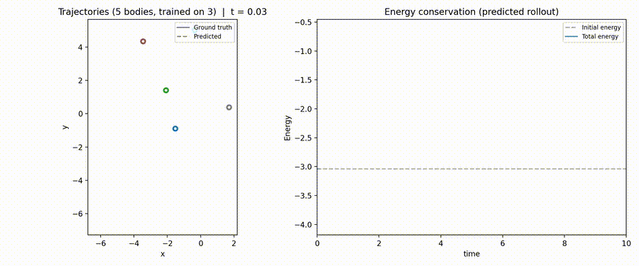

# Learning N-Body Physics with Graph Neural Networks



This project explores a simple idea:

> Physical systems are naturally graphs.

In an N-body system, each body is an object and each pair of bodies interacts
through gravity. A graph neural network gives us a clean way to represent that:

- bodies are **nodes**
- pairwise gravitational interactions are **edges**
- the network learns how objects influence one another
- the learned interactions are added together to predict each body's acceleration

The goal is not to hard-code Newton's law into the model. Instead, we generate
simulated trajectories and train the network to learn the dynamics from data.

## Result

The animation above shows a five-body rollout from a model trained only on
three-body systems. The learned trajectory is rolled forward autoregressively
from predicted accelerations.

## How It Works

At each time step, the system is converted into a directed graph.

Each node contains the state of one body:

```text
position, velocity, mass
```

Each directed edge represents the possible influence of one body on another.
The graph neural network processes all pairwise interactions, sums the incoming
effects for each body, and predicts acceleration.

Those predicted accelerations are then integrated forward to produce a full
trajectory.

## Why Graphs?

Gravity is pairwise: every body pulls on every other body.

That makes the N-body problem a good fit for graph neural networks because the
model can learn one shared interaction rule and apply it across all pairs. The
same learned rule can then be reused for systems with more bodies than were seen
during training.

## Evaluation

The model is evaluated by rolling it forward in time and comparing the predicted
trajectory to a ground-truth physics simulation.

We look at:

- **trajectory error:** how far predicted positions drift from ground truth
- **constant-velocity baseline:** whether the model beats a simple no-force guess
- **energy drift:** whether the predicted motion remains physically plausible

## Repository Contents

```text
code/      simulator, dataset, model, training, evaluation, visualization
docs/      LaTeX report and images
hparams/   experiment configurations
runs/      saved experiment metadata
papers/    reference paper
```

## Running It

Create the environment:

```bash
conda env create -f environment.yml
conda activate nbody-gnn
```

Train a model:

```bash
python code/train.py --hparams hparams/hparams_3.yml
```

Evaluate a trained model:

```bash
python code/evaluate.py \
  --checkpoint runs/n3_h150_l4_ef50_sims2000_lr0.001_ep200_seed0/best_model.pt \
  --n-test-bodies 5 \
  --output-fig runs/eval_5body.png
```

Generate an animation:

```bash
python code/visualize.py \
  --checkpoint runs/n3_h150_l4_ef50_sims2000_lr0.001_ep200_seed0/best_model.pt \
  --n-bodies 5 \
  --output runs/rollout_5body.mp4
```

## Reference

This project is based on the Interaction Network architecture introduced in:

Peter W. Battaglia, Razvan Pascanu, Matthew Lai, Danilo Rezende, and Koray
Kavukcuoglu. *Interaction Networks for Learning about Objects, Relations and
Physics*. arXiv:1612.00222, 2016.
